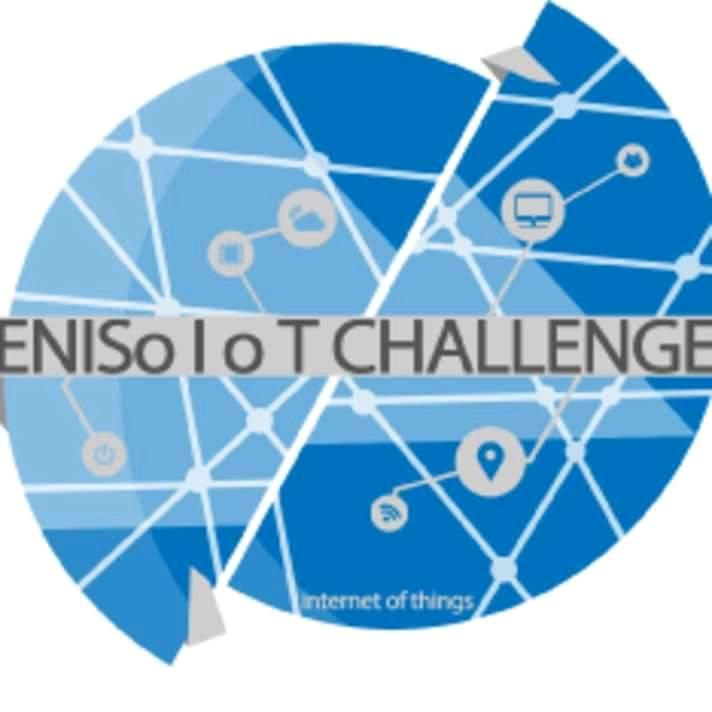
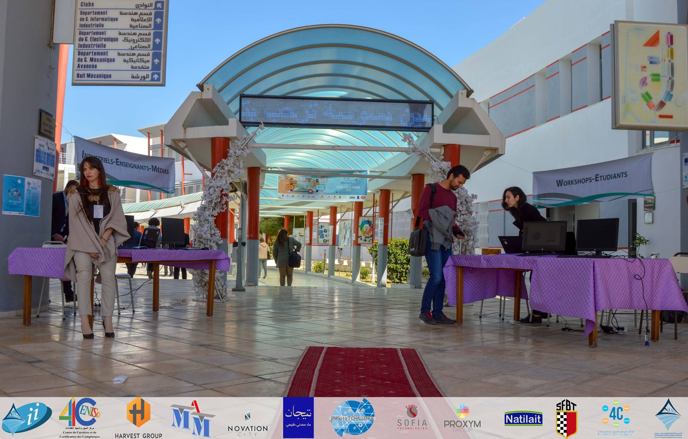
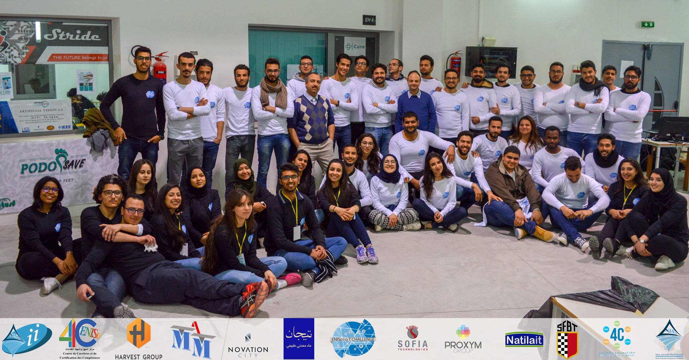

# ENISo IoT Challenge

## Navigation
- **Logo**: 
- **Links**:
  - [ACCUEIL](#home)
  - [À PROPOS](#package)
  - [ÉDITIONS](#editions)
  - [WORKSHOPS](#workshops)
  - [CONTACT](#contact)

## Header
**5ÈME ÉDITION DU ENISo IoT CHALLENGE**

### Innovation, Créativité, et Technologie

[Participez Maintenant](https://docs.google.com/forms/d/TON_ID_DU_FORMULAIRE/viewform)

## À Propos de l'Événement

« ENISo Internet of Things Challenge» est un événement organisé par L'Ecole Nationale d'Ingénieurs de Sousse qui marque l‘immersion de l'école dans le peloton des avancées technologiques de notre ère. ENISo IOT Challenge est lancée en Avril 2018, elle vise à rassembler des professionnels, des spécialistes, des industriels et des étudiants pour discuter et explorer les innovations dans le domaine de l'Internet des objets.

Après 4 éditions couronnées de succès, l’ENISo Internet of Things Challenge revient pour une 5ème édition unique par sa philosophie.

## Éditions Précédentes

### 2016 - Smart Agriculture
Intégration des technologies dans l'agriculture pour une gestion optimisée des ressources et une meilleure productivité.

### 2017 - Smart City
Utilisation des technologies intelligentes pour améliorer les infrastructures urbaines, les transports et les services publics.

### 2018 - Smart Environment
Innovations en matière de gestion des déchets, d'énergie renouvelable et de lutte contre la pollution pour un avenir plus durable.

### 2019 - Smart Retail
Transformation numérique du commerce avec des solutions intelligentes, recommandations basées sur l'IA.

## Participants

Cette compétition organisée par l’École Nationale d’Ingénieurs de Sousse a provoqué une nitescence spectaculaire (550 personnes) et une très bonne couverture médiatique.

- **500** Étudiants
- **20** Enseignants
- **10** Médias
- **20** Experts et industries

## Workshops et Ateliers

Des sessions animées par des experts pour approfondir vos connaissances et compétences en IoT.

- **E-HEALTH & IOT** - Assuré par NOCCS
- **DATA SCIENCE** - Assuré par InstaDeep
- **CHATBOT** - Assuré par SOFIA
- **AI & INDUSTRY 4.0** - Assuré par DATAVORA

## Footer

### ENISo IoT Challenge
L'ENISo IoT Challenge est un événement annuel organisé par l'École Nationale d'Ingénieurs de Sousse pour promouvoir l'innovation et la créativité dans le domaine de l'Internet des Objets.

### Liens Rapides
- [Accueil](#home)
- [À Propos](#package)
- [Éditions](#editions)
- [Workshops](#workshops)

### Contact
- **Email**: eniso.iot.challenge@gmail.com
- **Téléphone**: +216 25 316 630
- **Adresse**: ENISo, Sousse, Tunisie

### Carte
<iframe src="https://www.google.com/maps/embed?pb=!1m18!1m12!1m3!1d3235.166340734548!2d10.590515375304642!3d35.820394322317554!2m3!1f0!2f0!3f0!3m2!1i1024!2i768!4f13.1!3m3!1m2!1s0x12fd8aeb930217f1%3A0x26a65273b05b6eff!2sEcole%20Nationale%20d&#39;Ing%C3%A9nieurs%20de%20Sousse!5e0!3m2!1sfr!2stn!4v1738443799281!5m2!1sfr!2stn" width="350" height="250" style="border: 1px;" allowfullscreen="" loading="lazy" referrerpolicy="no-referrer-when-downgrade"></iframe>

### Réseaux Sociaux
- [Facebook](https://www.facebook.com/enisoiotchallenge)
- [Instagram](https://www.instagram.com/orangetechclubeniso?igsh=MXRmMXM4YjVvOHkyOQ==)
- [LinkedIn](https://www.linkedin.com/company/orange-tech-club-eniso/)

### Copyright
Copyright © 2024 ENISo IoT Challenge. Tous droits réservés.